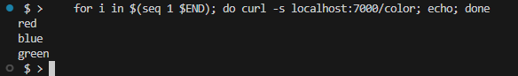

## Overview

This repository is based on the example from AWS Repo that covers [base setup](https://github.com/aws/aws-app-mesh-examples/blob/main/walkthroughs/eks/base.md). The example
here deploys the same the simple `color` application and provides the same expected result. For the traffic steering we use Istio ([Tetrate's distro](https://aws.amazon.com/marketplace/pp/prodview-rm6w3vwyibt46?sr=0-1&ref_=beagle&applicationId=AWSMPContessa)) while the upstream example leverages AWS App Mesh. This example allows App Mesh users to get the technical 
guidance on migrating from AWS App Mesh to Istio. The Istio example can be run side-by-side in the same cluster with applications that use AWS App Mesh. Kubernetes `namespace` is a natural separator between the applications that leverage AWS App Mesh and Istio in the single cluster.


## Prerequisites

1. Deploy Istio - any way to deploy Istio will work. The easiest one is probably via [Tetrate Istio Distro add-on](https://tetratelabs.github.io/tid-addon-workshop/4_deploy_tid_addon/). 

2. Install Docker. It is needed to build the demo application images.

3. Make sure that kubectl and jq are deployed on your console.

4. Your kubernetes context is pointing to the correct cluster.


## Setup

1. Clone this repository and navigate to the root directory., all commands will be ran from this location
1. **Your** account id:

    ```
    export AWS_ACCOUNT_ID=<your_account_id>
    ```

1. **Region** e.g. us-west-2

    ```
    export AWS_DEFAULT_REGION=us-west-2
    ```

1. Deploy by running the script that is heavily modified version of the AWS App Mesh script

    ```.
    ./deploy-istio.sh
    ```   
    
1. Note that the example apps use go modules. If you have trouble accessing https://proxy.golang.org during the deployment you can override the GOPROXY by setting `GO_PROXY=direct`

   ```
   GO_PROXY=direct ./deploy.sh
   ``` 
       
1. Set up [port forwarding](https://kubernetes.io/docs/tasks/access-application-cluster/port-forward-access-application-cluster/) to route requests from your local computer to the **client** pod. The local port is up to you but we will assume the local port is **7000** for this walkthrough. Below is an example that retrieves namespace that is set by the `deploy-istio.sh` script.

   ```bash
   APP_ISTIO_NAMESPACE=$(kubectl get namespaces -ojson | jq -r .items[].metadata.name | grep "\-istio")
   kubectl -n $APP_ISTIO_NAMESPACE port-forward deployment/client 7000:8080 > /dev/null &
   ```

1. In order to validate that the requests are distributed between your internal services equally run the requests against `client` pod. It will forward the requests to `color` service and those requests will be equally distributed between `red`, `green` and `blue` services by Istio **ROUND_ROBIN** algorithm:
:
    ```
    END=3
    for i in $(seq 1 $END); do curl -s localhost:7000/color; echo; done
    ```  
    
1. Using the name of the client pod run the following command to tail the client app logs:
    ```
    kubectl logs -f -n <namespace> <pod_name> app
    ```

1. Initially the state of your mesh is a client node with an even distribution to 3 color services (red, blue, and green) over HTTP/2. Prove this by running the following command a few times:
    ```
    curl localhost:7000/color
    ```

    The output should look similar to below:

    

## Conclusion 

This example helps to understand a general changes that allow to replace AWS App Mesh functionality with Istio powered Service Mesh. Please provide us your App Mesh use-case via GH Issues.
This would allow Tetrate to share more examples on App Mesh migration to Istio Service Mesh.